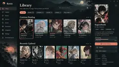
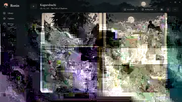
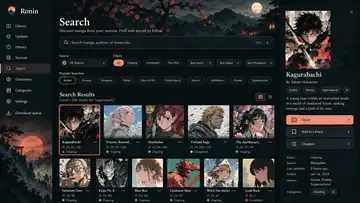
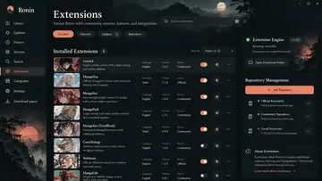
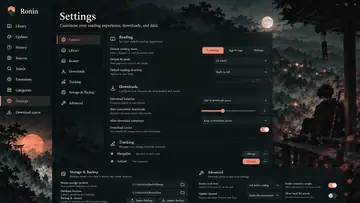

# Ronin — Visual Fidelity Source of Truth

Status: **approved visual direction for the Phase 10 continuation**.

This file and the mockups in `mockups-v2/` are the visual source of truth for the next Ronin desktop implementation pass.

## Mandatory base

- Repository: `Angeltr167/mihon-windows`
- Parent branch: `chatgpt/ronin-p10-final-polish`
- Parent HEAD: `5fd618c6316985edc68a7393c462536c66ac6ccc`
- Visual-fidelity branch: `chatgpt/ronin-p10-visual-fidelity`
- **Do not rebase this work onto `main`.**
- **Do not merge automatically.**

## Approved mockups

> These are compressed repository previews of the approved mockups. They define composition, visual hierarchy, color direction, atmosphere, spacing, typography, surface treatment, and branding. Manga titles/covers shown are illustrative only and must not be bundled as fake user content.

### Library

### Reader

### Search

### Extensions

### Settings

## Core intent

Ronin must feel like a **premium manga desktop application**, not a generic dark Material app and not “Mihon with a theme”.

The visual language is:

- desktop-first
- editorial and cinematic
- dark ink / charcoal foundation
- warm ivory text
- muted coral / apricot as the principal active accent
- restrained sage / mint for supporting success/progress states
- large editorial serif page headings
- clean sans-serif for body copy, metadata and controls
- atmospheric moon / mountain / shrine artwork integrated into the shell
- covers remain the visual protagonists
- dense enough for PC without becoming noisy
- panels feel calm, premium and purposeful rather than like oversized SaaS cards

## Absolute implementation rules

1. **Read this file and inspect every mockup before changing code.**
2. Follow the mockups closely in composition, hierarchy, typography, spacing, surfaces and selected states.
3. Preserve current functionality unless a tiny structural UI change is strictly required.
4. Use real app state and real user data.
5. Do not invent fake metrics, ratings, source health numbers, verified identities or features merely because a mockup contains illustrative content.
6. Do not ship the manga artwork/titles from these mockups as sample library content.
7. Do not regress reader navigation, zoom, fit modes, reading modes, shortcuts, restore position, downloads, extensions, categories, search, tracking or backup.
8. Do not rewrite repositories/services/backend logic for cosmetic reasons.
9. Do not touch Android as part of this pass.
10. Do not merge automatically.

## Global shell

The shell must be recognizably Ronin across all screens.

### Sidebar

Keep the existing section structure:

- Library
- Updates
- History
- Sources
- Search
- Extensions
- Categories
- Settings
- Download queue

Visual requirements:

- Ronin branding/logo area at top
- strong selected state using the warm accent
- calm icon/label alignment
- atmospheric artwork integrated toward lower/empty sidebar regions
- compact desktop spacing
- responsive behavior must remain usable at the current minimum window size

### Headers

- large editorial page title
- supporting subtitle in quieter text
- top controls aligned as one coherent desktop command area
- search fields and view toggles should look custom to Ronin rather than stock Material defaults

### Context panel

Where the current responsive layout allows a right inspector:

- use the same surface language as the shell
- selected manga/source/extension context should feel integrated
- preserve the current breakpoint behavior unless a visual-only adjustment is necessary

## Color and surface direction

Use the current dark Ronin foundation as a base, but evolve it toward the approved mockups:

- blue-black / charcoal ink background
- slightly lifted charcoal panels
- warm ivory primary text
- muted neutral secondary text
- coral/apricot active accent
- sage/mint supporting accent
- thin low-contrast borders
- soft elevation only where useful
- no neon glow
- no excessive gradients
- no generic purple Material remnants

The atmospheric art must support the UI and must never compromise text readability.

## Typography

- screen/page headings: editorial serif with stronger scale and presence
- section headings: serif where appropriate
- manga/card titles: highly readable and slightly stronger than metadata
- body/metadata/controls: clean sans-serif
- hierarchy should be more dramatic than the current Phase 10 implementation while remaining practical on Windows

## Shared components

Before screen-by-screen work, consolidate the visual system around:

- `RoninDesignTokens.kt`
- `RoninTheme.kt`
- `RoninTypography.kt`
- `RoninComponents.kt`
- `RoninShellLayout.kt`

Remove visual inconsistencies where newer Ronin components coexist with legacy `MihonPalette`, `MihonPanel`, `MihonSpacing`, or unstyled Material controls, especially in Settings and Downloads.

This is a presentation cleanup, **not** permission to change the functional contracts behind those controls.

## Library

Reference: `mockups-v2/library.webp`

Target traits:

- strong Ronin header
- compact filters
- prominent Continue Reading area
- Recently Updated beneath it
- cover-first cards
- clear progress
- selected manga inspector on wide windows
- atmospheric shell/background without reducing readability

Use the existing real library/progress/category/source data.

## Reader

Reference: `mockups-v2/reader.webp`

Target traits:

- immersive manga-first canvas
- premium double-page presentation
- restrained atmospheric surroundings
- compact top controls
- elegant bottom progress/navigation bar
- page navigation affordances that do not steal focus

**Phase 9 reader behavior is functionally frozen.** Visual polish must not break:

- single/double/vertical/webtoon modes
- LTR/RTL
- zoom
- fit modes
- page/chapter navigation
- keyboard shortcuts
- auto-hide behavior
- restored progress

## Search

Reference: `mockups-v2/search.webp`

Target traits:

- prominent search field
- compact source/filter controls
- clean result grid
- right manga inspector on wide windows
- same manga/card language as Library

Only expose filters/actions that correspond to real behavior.

## Extensions

Reference: `mockups-v2/extensions.webp`

Target traits:

- Installed / Discover / Updates / Repository tabs
- dense desktop rows
- strong engine/status context
- repository management on the right where space allows
- consistent Ronin controls

Preserve actual extension security/trust semantics. Never present locally trusted fingerprints as verified identities unless the underlying implementation proves that status.

## Settings

Reference: `mockups-v2/settings.webp`

Target traits:

- clear settings sub-navigation
- coherent grouped setting panels
- atmospheric artwork used as composition, not decoration over text
- custom Ronin switches/sliders/dropdowns/buttons
- eliminate the current visual split between old Mihon styling and newer Ronin styling

All settings must remain backed by the existing real state/actions.

## Updates, History, Sources, Categories and Downloads

They do not have a new V2 image in this set, so derive them from the **same exact design system** shown by the five approved mockups and their existing real functionality.

Use the older section mockups only for information architecture where useful; visually, this V2 document takes precedence.

Downloads and Settings deserve special attention because Phase 10 currently contains the most visible mixture of legacy and Ronin presentation.

## Background artwork rule

The approved mockups use bespoke environmental artwork to establish identity.

For implementation:

- do not scrape random anime art
- do not use copyrighted manga panels as application chrome
- use project-owned/original decorative artwork or a code-generated/approved asset created specifically for Ronin
- keep the artwork separate from user manga content
- ensure it scales/crops gracefully and remains subtle behind UI surfaces
- provide a graceful fallback if an artwork resource cannot load

## Functional freeze boundary

Avoid changes to:

- DesktopMangaRepository/data schema
- download scheduler/store semantics
- source/network engines
- tracker implementations
- backup model behavior
- core reader navigation
- Android modules

If a genuine functional bug is discovered, report it separately rather than silently folding a behavior change into the visual pass.

## Responsive requirements

Validate the visual system at minimum:

- 800×560 logical minimum
- medium desktop window
- 1080p
- 1440p / wide desktop
- high-DPI scaling where available

No essential action may disappear solely to preserve the mockup composition.

## Suggested implementation order

1. tokens/theme/typography
2. shell/navigation/background treatment
3. shared buttons, fields, chips, rows and panels
4. Library as the reference screen
5. Search
6. Extensions
7. Settings
8. Updates / History / Sources / Categories / Downloads
9. Reader visual polish only
10. responsive/accessibility cleanup
11. compile/tests/regression validation
12. manual visual validation

## Acceptance criteria

The pass is not complete merely because it compiles.

It is complete only when:

- the app is immediately recognizable as the product shown in these mockups
- the shell, typography, surfaces, buttons, selected states and artwork treatment are consistent
- Library/Search/Extensions/Settings visibly match the approved V2 direction
- the remaining sections clearly belong to the same design system
- Reader keeps all approved behavior
- real functionality remains intact
- no fake mockup data is presented as real
- no work has been rebased onto `main`
- nothing has been merged automatically

When fidelity conflicts with real behavior, **preserve functionality first and reproduce the visual intent as closely as possible around it**.
